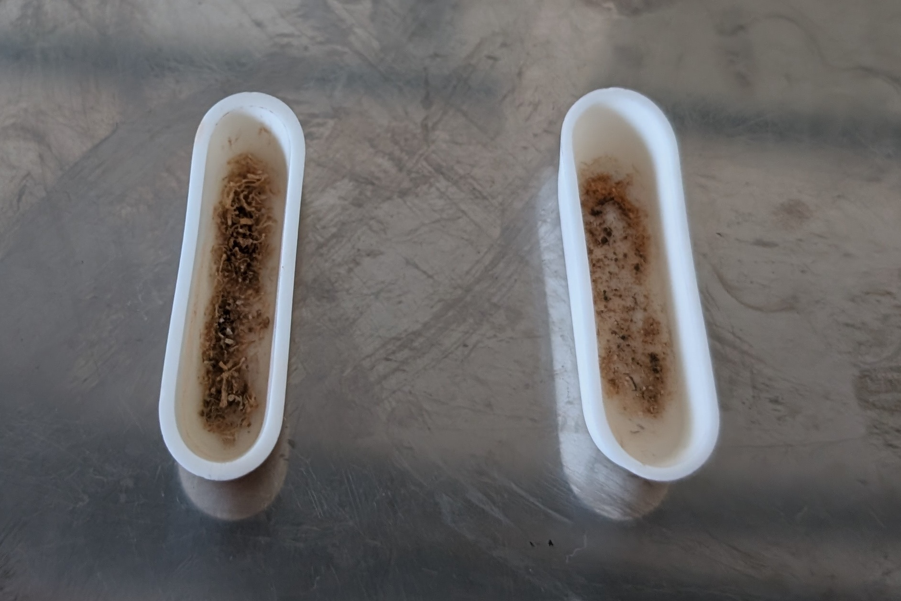

```{r setup, include=FALSE}
knitr::opts_chunk$set(echo = TRUE)

library(magrittr)
library(readxl)
library(dplyr)
library(tidyr)
library(ggplot2)
library(ggiraph)
library(ggpubr)
library(patchwork)
```

This report documents the method for obtaining the total organic carbon content (TOC) in the _Zostera noltii_ seagrass. This includes information compiled from:

* [The fieldtrip of Aveiro 2025](https://sigoiry.github.io/Spectra_Aveiro_2025/) by [Simon Oiry](https://github.com/SigOiry)
* [Coring Carbon Seagrass](https://sigoiry.github.io/Coring_Carbon_Seagrasses/) by Simon Oiry
* [The fieldtrip of Bourgneuf Bay 2025](https://sigoiry.github.io/Fieldtrip_Rewrite_Sept2025/) by Simon Oiry
* [Exploring the relationship between seagrass reflectance and biomass](https://leechengfa.github.io/Seagrass_reflectance_biomass_2025.github.io/) by C. Benjamin Lee

All analyses were performed in R version 4.5.2 [@Rversion].
All work belong to the [REWRITE project](https://rewriteproject.eu/).

# Method

## Study sites and planning of collection points

Fieldwork was done in Cadiz, Aveiro and Bourgneuf Bay. These three sites have been covered in @davies2024.

### Cadiz Bay

```{r calcFieldCB}
#| echo: false
#| error: false
#| message: false
#| warning: false

csv.biomass.CB <- read_xlsx('data/biomass/Cadiz_Biomass_C_cores.xlsx') %>%
  filter(Group == 'Leaves' | Group == 'Roots') %>%
  select(c(Group, Sample, `Dry mass (g)`)) %>%
  filter(!Sample %in% c('27','28','29','30')) %>% # planned sites that were not accomplished (10 of each type)
  pivot_wider(names_from = Group, values_from = `Dry mass (g)`) %>%
  mutate(type = case_when(# High cover
                        Sample < 10 ~ 'High',
                        Sample >= 10 & Sample < 18 ~ 'Mid',
                        Sample >= 18 ~ 'Bare'
                        ),
         Leaves = as.numeric(Leaves),
         Roots = as.numeric(Roots),
         name = paste0("ST", sprintf("%02d", as.numeric(1:26)))
         )

csv.biomass.CB$Leaves <- csv.biomass.CB$Leaves * 100^2 / (pi*(15/2)^2)  # conversion to g/m2
csv.biomass.CB$Roots <- csv.biomass.CB$Roots * 100^2 / (pi*(15/2)^2)  # conversion to g/m2
  
table.amtFieldCB <- data.frame(
    list(
      "code" = c('High', 'Mid', 'Bare'),
      "system" = c('100% seagrass cover (high)','Intermediate seagrass cover','0% seagrass cover (bare)'),
      "planned" = rep(10, 3), 
      "actual" = as.numeric(table(csv.biomass.CB$type)[c('High','Mid','Bare')])
    )) 
```

Cadiz Bay is one of the [demonstrator sites for the REWRITE PROJECT](https://rewriteproject.eu/demonstrator-network/cadiz-bay). Its seagrass meadow was estimated to be 2.09 km^2^ during the peak season of 2024 [@davies2024].

As one of the demonstrator sites, Cadiz Bay has a rewilding/restoration site and a natural/control site. However, seagrass meadows were not available at either sites. Thus, another seagrass meadow site in Cadiz Bay was selected to represent the seagrass and their potential blue carbon capacity there. A transect survey was conducted and stations were selected based on the visually assessed seagrass cover (Table \@ref(tab:amountFieldCB)). A total of `r sum(table.amtFieldCB$actual)` stations were sampled.


```{r amountFieldCB}
#| echo: false
#| error: false
#| message: false
#| warning: false

names(table.amtFieldCB) <- c("Code", "Sampling system", "Planned no. of field stations", "Actual no. of field stations")

knitr::kable(table.amtFieldCB, 
             format = "pipe",
             align = 'c',
             caption = 'Field sampling design at Cadiz Bay. All stations at Cadiz Bay were given a one word code corresponding to their visually assessed seagrass code, and a non-repeating station number across all codes.')
```

### Ria de Aveiro

```{r calcFieldAV}
#| echo: false
#| error: false
#| message: false
#| warning: false

csv.biomass.AV <- read_xlsx('data/biomass/Aveiro_grid_info_final.xlsx', sheet = 'data')

convert_mg_to_gm2 <- function(num) {
  num / 1000 * (100^2 / (pi*(15/2)^2))
}

csv.biomass.AV$seagrassA <- convert_mg_to_gm2(csv.biomass.AV$seagrassA) # conversion to g/m2
csv.biomass.AV$seagrassB <- convert_mg_to_gm2(csv.biomass.AV$seagrassB)  # conversion to g/m2

Av.RG <- csv.biomass.AV$site == 'rewilded' & csv.biomass.AV$type == 'grid'
Av.RR <- csv.biomass.AV$site == 'rewilded' & csv.biomass.AV$type == 'random'
Av.NG <- csv.biomass.AV$site == 'natural' & csv.biomass.AV$type == 'grid'
Av.NR <- csv.biomass.AV$site == 'natural' & csv.biomass.AV$type == 'random'

table.amtFieldAV <- data.frame(
    list(
      "code" = c('RG', 'RR', 'NG', 'NR'),
      "site" = c('Rewilded', 'Rewilded', 'Natural','Natural'),
      "system" = c('Grid','Random','Grid','Random'),
      "planned" = c(sum(Av.RG), sum(Av.RR), sum(Av.NG), sum(Av.NR)), 
      "actual" = c(sum(!is.na(csv.biomass.AV$seagrassA) & Av.RG), sum(!is.na(csv.biomass.AV$seagrassA) & Av.RR), sum(!is.na(csv.biomass.AV$seagrassA) & Av.NG), sum(!is.na(csv.biomass.AV$seagrassA) & Av.NR))
    )) 

rm(Av.RG, Av.RR, Av.NG, Av.NR)
```

Ria de Aveiro is one of the [demonstrator sites for the REWRITE PROJECT](https://rewriteproject.eu/demonstrator-network/ria-de-aveiro). Its seagrass meadow was estimated to be 3.52 km^2^ during the peak season of 2024 [@davies2024].

Similar to Cadiz Bay, Ria de Aveiro is also a demonstrator site with a rewilding and natural site. Seagrasses are found in both sites. For each site, a grid sampling system was implemented. 

At the rewilded site, a four by eight grid was set up, with a 50 m distance from the next station. In addition, a random sampling of `r table.amtFieldAV$planned[table.amtFieldAV$code == "RR"]` stations was added to the same grid area. Meanwhile, a four by seven grid was used instead, with a 50 m distance from the next station. Similar to the rewilded site, a random sampling of `r table.amtFieldAV$planned[table.amtFieldAV$code == "NR"]` stations was added to the same grid area. 

During the fieldwork, it was discovered that some of the planned grid stations were marshes or creeks, and thus unsuitable habitats for seagrass monitoring. Thus, a total of `r sum(table.amtFieldAV$actual)` stations were sampled at Ria de Aveiro. Table \@ref(tab:amountFieldAV) shows the breakdown by site and sampling system.

```{r amountFieldAV}
#| echo: false
#| error: false
#| message: false
#| warning: false

names(table.amtFieldAV) <- c("Code", "Site", "Sampling system", "Planned no. of field stations", "Actual no. of field stations")

knitr::kable(table.amtFieldAV, 
             format = "pipe",
             align = 'c',
             caption = 'Field sampling design at Ria de Aveiro. All stations at Ria de Aveiro were given a two letter code corresponding to their site and sampling system, and a station number.')
```


### Bourgneuf Bay

```{r calcFieldBB}
#| echo: false
#| error: false
#| message: false
#| warning: false

csv.biomass.BB <- read_xlsx('data/biomass/BourgneufBay_DryWeight_Cores.xlsx', sheet = 'Feuil1')

csv.biomass.BB$A <- csv.biomass.BB$A * 100^2 / (pi*(15/2)^2)  # conversion to g/m2
csv.biomass.BB$B <- csv.biomass.BB$B * 100^2 / (pi*(15/2)^2)  # conversion to g/m2

table.amtFieldBB <- data.frame(
    list(
      "code" = c('L', 'H'),
      "site" = c('Highly variable seagrass presence/cover', 'Consistently dense'),
      "planned" = c(sum(grepl('L', csv.biomass.BB$Station)), sum(grepl('H', csv.biomass.BB$Station))), 
      "actual" = c(c(sum(grepl('L', csv.biomass.BB$Station)) - 1, sum(grepl('H', csv.biomass.BB$Station))))
    )) 
```

The seagrass meadow in Bourgneuf Bay is located close to [ISOMer](https://isomer.univ-nantes.fr/), the researchers' workplace, and has been covered in multiple studies [@bargain2013,@zoffoli2020,@davies2024]. Its meadow was estimated to be 4.94 km^2^ during the peak season of 2024 [@davies2024].

A historical analysis of the meadow over 40 years was performed to identify areas in the meadows which are either consistently dense in seagrass or have a highly variable seagrass density. Site L was located in an area with a strong variability in seagrass density while site H was placed in a consistently dense part of the meadow.

For each site, `r mean(unlist(table.amtFieldBB$planned))` stations were chosen to represent a range of seagrass cover from zero to 100%, based on an _in-situ_ visual assessment. Unfortunately, one sample for site L was unfortunately lost between the field collection and sorting, most likely during the transportation, resulting in a final sample size of `r table.amtFieldBB$planned[table.amtFieldBB$code == "L"]` for site L (Table \@ref(tab:amountFieldBB)).

```{r amountFieldBB}
#| echo: false
#| error: false
#| message: false
#| warning: false

names(table.amtFieldBB) <- c("Code", "Site", "Planned no. of field stations", "Actual no. of field stations")

knitr::kable(table.amtFieldBB, 
             format = "pipe",
             align = 'c',
             caption = 'Field sampling design at Bourgneuf Bay. All stations at Bourgneuf were given a one letter code corresponding to their site, accompanied with a station number.')
```


## Field survey and sample collection

### _In situ_ field survey

For every station, seagrass cover was visually assessed with the aid of a 50 cm by 50 cm quadrat. The location of each station was measured using an Emlid Reach RS2+ GNSS receiver with RTK corrections from the Teria Network.

For select stations, _in situ_ spectroradiometric measurements were measured using an [ASD FieldSpec HandHeld 2](https://www.malvernpanalytical.com/en/support/product-support/asd-range/fieldspec-range/handheld-2-hand-held-vnir-spectroradiometer). The ASD was calibrated using a white reference panel before each measurement to account for possible ambient light changes and instrumental noise. 20 readings were measured per station and averaged to obtain an averaged spectra. The spectra were then smoothed with a moving window of size 11 using the `rollapply()` function from the `zoo` package [@zoo2005]. While this means that the first and last five wavelengths would be smoothed with a partial moving window of less than 11 values, given the spectroradiometer's full wavelength range of 325 nm to 1075 nm and the final working range of 400 nm to 900 nm, these affected wavelengths will be filtered out and thus irrelevant here.


### Sample collection

Sediment cores were collected using a 15 cm diameter length PVC tube. The coring was sufficiently deep, such that all belowground biomass were collected.

The collected samples were rinsed and sieved using a 40 cm diameter stainless steel sieve with a mesh size of 1 mm to remove as much substrate as possible. The samples were then transported to back to the laboratory and preserved in a fridge.


### Sorting

The samples were sorted into leaf and root matter by separating the plant at the [internode](https://link.springer.com/article/10.1007/s10750-012-1153-6/figures/7). 


### Drying

The samples were dried in an oven at 60 &deg;C for 48 hours. After desiccation, the samples were weighed using a bench scale to obtain their dry weight. 


### Grinding

The dried samples were placed in 50 ml falcon tubes with a ceramic ball of diameter 20 mm. The tubes were loaded onto the [Mixer Mill MM 400](https://www.retsch.com/products/milling/ball-mills/mixer-mill-mm-400/) and grinded at 30 Hz at 30 seconds. If the initial grinding was insufficient, it was repeated at the same intensity and period until the samples were [homogeneous](https://www.retsch.com/files/5771/expert-guide-milling.pdf). Homogeneous powdered samples are required for the carbon content measurement and will be elaborated in section \@ref(toc-measurement).


## Data selection

For the year 2025, a total of `r sum(17, sum(table.amtFieldAV['Actual no. of field stations']), sum(table.amtFieldBB['Actual no. of field stations']))` field samples were collected across the three sites (Table \@ref(tab:amountFieldSamples)). In principle, it would be best to measure the carbon content of all the available biomass samples. However, not only does each sample consist a leaf and root sample, but also both the total carbon (TC) and inorganic carbon (IC) content needs to be measured to obtain the total organic carbon (TOC) content (see section \@ref(toc-measurement)). Thus, the actual amount of laboratory work is approximately quadrupled per station with a non-zero amount of seagrass biomass. To optimise the laboratory work to a more feasible load, 30 samples each were selected from the Aveiro and Bourgneuf Bay locations, while all 17 samples in Cadiz were kept. 


```{r amountFieldSamples}
#| echo: false
#| error: false
#| message: false
#| warning: false

table.amtFieldSamples <- data.frame(
    list(
      "no. samples" = c(17, 
                        sum(table.amtFieldAV$`Actual no. of field stations`), 
                        sum(table.amtFieldBB$`Actual no. of field stations`)
                        ),
      "no. nonzero" = c(17,
                        sum(!is.na(csv.biomass.AV$seagrassA) & csv.biomass.AV$seagrassA > 0), # there is a station with AGB but no BGB
                        sum(!is.na(csv.biomass.BB$B) & csv.biomass.BB$B > 0) # one station is missing its BGB 
                        )
    ),
    row.names = c('Cadiz Bay', 
                  'Ria de Aveiro', 
                  'Bourgneuf Bay')
  ) 
  names(table.amtFieldSamples) <- c("No. of field samples", "No. of field samples with biomass")

knitr::kable(table.amtFieldSamples, 
             format = "pipe",
             align = 'c',
             caption = 'Number of biomass samples collected from the field. Each sample consists leaf and rhizome materials, which correspond to the aboveground and belowground biomass. To ensure the representation of the range of seagrass cover, stations with zero seagrass cover are also included. Naturally, most of these stations would either have no seagrass biomass or a very low amount.')
```

### Cadiz Bay

```{r selectionCBpreprocess}
#| echo: false
#| error: false
#| message: false
#| warning: false

## all bare stations should have zero leaf and root weight. Any leaf weight without root weight are drift leaves and thus not considered
csv.biomass.CB$Leaves[csv.biomass.CB$Sample > 17] <- 0
csv.biomass.CB$Roots[csv.biomass.CB$Sample > 17] <- 0

## 370 mg as the recommended minimum for TC and IC measurements; conversion to the same scale
recommended_minimum <- convert_mg_to_gm2(370)
```

While all the samples from Cadiz Bay will be used in the carbon content measurement, it would still be interesting to assess the matchup between its leaf and root biomass. Furthermore, none of the relevant samples at Cadiz Bay were too little for the carbon content measurement (Table \@ref(tab:amountSmallFieldSamplesCB)).

```{r amountSmallFieldSamplesCB}
#| echo: false
#| error: false
#| message: false
#| warning: false

table.amtSmallFieldSamples.CB <- csv.biomass.CB %>% 
  filter(Leaves < recommended_minimum | Roots < recommended_minimum) %>%
  arrange(name) %>%
  select(name, Leaves, Roots)

knitr::kable(table.amtSmallFieldSamples.CB %>% rename(c(Station = name, "Collected leaf biomass (g/m^2)" = Leaves, "Collected root biomass (g/m^2)" = Roots)), 
             format = "pipe",
             align = 'c',
             caption = 'Samples collected from Cadiz Bay that have insufficient biomass for the carbon measurement. Bare stations were expected to have no biomass. None of the non-bare station had insufficient biomass.')
```

Figure \@ref(fig:selectionCB) shows the relationship between the leaf and root biomass in Cadiz Bay. The stations with an intermediate cover have a similar relationship with the stations from the two other sites. Meanwhile, the stations with 100% cover in Cadiz Bay are estimated to have 2 to 4 times more leaf biomass than expected. 

```{r selectionCB}
#| echo: false
#| error: false
#| message: false
#| warning: false
#| fig.cap: Data exploration for the Cadiz Bay samples. The light blue rectangle denotes that the station has insufficient biomass for the carbon measurement, based on the requirements outlined in section \@ref(toc-measurement). All plots establishes the general relationship between leaf and root biomass for (A) all stations, (B) bare and intermediate cover stations only, and (C) high cover stations only. The black dotted line represents the overall linear relationship between leaf and root biomass across all three locations, calculated [here](https://leechengfa.github.io/Seagrass_reflectance_biomass_2025.github.io/).

## filtering points High_01, High_02 and High_03 as their values seemed anomalous
csv.biomass.CB <- csv.biomass.CB %>%
  filter(name != 'High_01', name != 'High_02', name != 'High_03')

csv.biomass.CB$Roots[is.na(csv.biomass.CB$Roots)] <- 0 # replace NA values
csv.biomass.CB$Leaves[csv.biomass.CB$Roots == 0] <- 0 # when there are no root biomass, there should not be any leaf biomass

xmax <- 850
ymax <- 200

.xlab <- bquote('Leaf biomass'~(g/m^2))
.ylab <- bquote('Root biomass'~(g/m^2))

leaf_root_slope <- 0.69
leaf_root_intercept <- 9.2

## establishing a local linear relationship between leaf (AGB) and root (BGB)
plt.leaf_root <- ggplot(csv.biomass.CB, aes(x = Leaves, y = Roots)) +
  geom_rect(aes(xmin = 0, xmax = recommended_minimum, ymin = 0, ymax = recommended_minimum), alpha = 0.5, fill = 'lightblue') +
  geom_smooth(method = 'lm') + 
  geom_abline(intercept = leaf_root_intercept, slope = leaf_root_slope, linetype = 'dashed') + ## based on combined results
  geom_point_interactive(aes(tooltip = paste0("Station: ", name), data_id = name, colour = type)) +
  xlab(.xlab) + ylab(.ylab) +
  xlim(c(0,xmax)) + ylim(c(0, ymax)) +
  stat_regline_equation(label.x.npc = 'left', label.y.npc = 'top', decreasing = TRUE, aes(label =  paste(..eq.label.., ..adj.rr.label.., sep = "~~~~"))) +
  ggtitle('All stations')

plt.leaf_root_non_high <- ggplot(csv.biomass.CB %>% filter(type != "High"), aes(x = Leaves, y = Roots)) +
  geom_rect(aes(xmin = 0, xmax = recommended_minimum, ymin = 0, ymax = recommended_minimum), alpha = 0.5, fill = 'lightblue') +
  geom_smooth(method = 'lm') + 
  geom_abline(intercept = leaf_root_intercept, slope = leaf_root_slope, linetype = 'dashed') + ## based on combined results
  geom_point_interactive(aes(tooltip = paste0("Station: ", name), data_id = name, colour = type), show.legend = FALSE) +
  xlab(.xlab) + ylab(.ylab) +
  xlim(c(0,xmax)) + ylim(c(0, ymax)) +
  stat_regline_equation(label.x.npc = 'left', label.y.npc = 'top', decreasing = TRUE, aes(label =  paste(..eq.label.., ..adj.rr.label.., sep = "~~~~"))) +
  ggtitle('Bare and Intermediate stations')

plt.leaf_root_high <- ggplot(csv.biomass.CB %>% filter(type == "High"), aes(x = Leaves, y = Roots)) +
  geom_rect(aes(xmin = 0, xmax = recommended_minimum, ymin = 0, ymax = recommended_minimum), alpha = 0.5, fill = 'lightblue') +
  geom_smooth(method = 'lm') + 
  geom_abline(intercept = leaf_root_intercept, slope = leaf_root_slope, linetype = 'dashed') + ## based on combined results
  geom_point_interactive(aes(tooltip = paste0("Station: ", name), data_id = name, colour = type), show.legend = FALSE) +
  xlab(.xlab) + ylab(.ylab) +
  xlim(c(0,xmax)) + ylim(c(0, ymax)) +
  stat_regline_equation(label.x.npc = 'left', label.y.npc = 'top', decreasing = TRUE, aes(label =  paste(..eq.label.., ..adj.rr.label.., sep = "~~~~"))) +
  ggtitle('High stations')

## find model fit
log_model.CB <- lm(Roots ~ log(Leaves + 1e-9), data = csv.biomass.CB)
log_model.CB.summary <- summary(log_model.CB)
stat_regline.CB <- substitute(italic(y) == A*log*italic(x) + B * "," * ~italic(R)^2*adj ~ "=" ~ R2, list(A = format(unname(log_model.CB$coefficients[2]), digits = 2), B = format(unname(log_model.CB$coefficients[1]), digits = 2), R2 = format(log_model.CB.summary$adj.r.squared, digits = 3), x = "x", y = "y", adj = "[adj]")) %>%
  as.expression() %>%
  as.character()

plt.leaf_root_transformed <- ggplot(csv.biomass.CB, aes(x = Leaves, y = Roots)) +
  # geom_rect(aes(xmin = 0, xmax = log(recommended_minimum), ymin = 0, ymax = log(recommended_minimum)), alpha = 0.5, fill = 'lightblue') +
  # geom_smooth(method = 'lm') + 
  stat_smooth(formula = y ~ log(x + 1e-9)) + 
  geom_abline(intercept = leaf_root_intercept, slope = leaf_root_slope, linetype = 'dashed') + ## based on combined results
  geom_point_interactive(aes(tooltip = paste0("Station: ", name), data_id = name, colour = type), show.legend = FALSE) +
  xlab(.xlab) + ylab(.ylab) +
  # xlab(bquote('Log-transformed leaf biomass (g/m^2)')) + ylab(bquote('Log-transformed root biomass (g/m^2)')) +
  xlim(c(0,xmax)) + ylim(c(0, ymax)) +
  # stat_regline_equation(label.x.npc = 'left', label.y.npc = 'top', decreasing = TRUE, aes(label =  paste(..eq.label.., ..adj.rr.label.., sep = "~~~~"))) +
  annotate("text", x = 1, y = ymax - 3, hjust = 0, label = stat_regline.CB, parse = TRUE) +
  ggtitle('All stations (transformed)')

girafe(ggobj = plt.leaf_root + plt.leaf_root_transformed + plt.leaf_root_non_high + plt.leaf_root_high + 
               plot_annotation(tag_levels = 'A') + 
               plot_layout(design = 'AB
                                     CD', 
                           guides = 'collect', axis_titles = 'collect'),
         options = list(
           opts_hover(css = "stroke-width:2.5px"),
           opts_hover_inv(css = "opacity:0.25"),
           opts_tooltip(opacity = 0.95, css = "padding:6px; font-size:12px")
         ),
         height_svg = 9, width_svg = 16
  )
```


### Ria de Aveiro {#dataselectionAV}

```{r selectionAVpreprocess}
#| echo: false
#| error: false 
#| message: false
#| warning: false

csv.biomass.AV <- csv.biomass.AV %>%
  select(-c(longitude, latitude, picture, poskey.sediment, remark, `sorting lab`))
  csv.biomass.AV$`spectral camera`[csv.biomass.AV$`spectral camera` == 'no'] <- NA
  csv.biomass.AV$spectra <- !is.na(csv.biomass.AV$`spectral camera`)
  
## all bare stations should have zero leaf and root weight. Any leaf weight without root weight are drift leaves and thus not considered
csv.biomass.AV$seagrassA[csv.biomass.AV$seagrassB == 0] <- 0
```

The samples at Ria de Aveiro were selected based on the following factors:

* Deviation from a linear relationship between the collected leaf and root biomass
* Clustering in the 2D plot space between the collected leaf and root biomass
* Deviation from a linear relationship between the seagrass cover and the leaf biomass
* Availability of _in situ_ hyperspectral measurements (n = `r sum(csv.biomass.AV$spectra)`)
* Elimination of stations which have no seagrass biomass (n = `r nrow(filter(csv.biomass.AV, seagrassA + seagrassB == 0 | is.na(seagrassA) & is.na(seagrassB)))`)

Of the stations with hyperspectral measurements, `r csv.biomass.AV %>% filter(seagrassA < recommended_minimum | seagrassB < recommended_minimum) %>% select(spectra) %>% sum()` have too little samples for the carbon measurement (more in section \@ref(toc-measurement)). They are:

```{r amountSmallFieldSamplesAV}
#| echo: false
#| error: false
#| message: false
#| warning: false

table.amtSmallFieldSamples.AV <- csv.biomass.AV %>% 
  filter(seagrassA < recommended_minimum | seagrassB < recommended_minimum) %>%
  filter(spectra == TRUE) %>%
  arrange(name) %>%
  select(name, seagrassA, seagrassB)

knitr::kable(table.amtSmallFieldSamples.AV %>% rename(c(Station = name, "Collected leaf biomass (g/m^2)" = seagrassA, "Collected root biomass (g/m^2)" = seagrassB)), 
             format = "pipe",
             align = 'c',
             caption = 'Samples collected from Ria de Aveiro that have insufficient biomass for the carbon measurement. These samples have hyperspectral measurements.')
```

Table \@ref(tab:amountSmallFieldSamplesAV) shows that `r nrow(filter(table.amtSmallFieldSamples.AV, seagrassA + seagrassB == 0))` stations have no samples at all and `r nrow(filter(table.amtSmallFieldSamples.AV, seagrassA + seagrassB != 0 & seagrassA == 0 | seagrassA + seagrassB != 0 & seagrassB == 0))` station have no leaf or root samples for sampling. Based on the stated criteria, these stations were removed for the list of viable stations for carbon sampling. For the remaining `r nrow(table.amtSmallFieldSamples.AV) - nrow(filter(table.amtSmallFieldSamples.AV, seagrassA + seagrassB == 0)) - nrow(filter(table.amtSmallFieldSamples.AV, seagrassA + seagrassB != 0 & seagrassA == 0 | seagrassA + seagrassB != 0 & seagrassB == 0))` stations, NR 43 could still be sampled as usual, with its root biomass sampling having close to the recommended `r convert_mg_to_gm2(300) %>% round(2) %>% format(nsmall = 2)` g/m^2^ for inorganic carbon content sampling. Meanwhile, RG 22 and RG 46 are both in the rewilded site and have very similar spectra. As such, they could be pooled together as one for the carbon sampling. 

Altogther, this means that `r 30 - (sum(csv.biomass.AV$spectra) - nrow(filter(table.amtSmallFieldSamples.AV, seagrassA == 0 | seagrassB == 0)) - 1)` samples need to be selected from the remaining `r sum(table.amtFieldAV['Actual no. of field stations']) - sum(csv.biomass.AV$spectra) - nrow(filter(csv.biomass.AV, seagrassA + seagrassB == 0))` samples which have neither hyperspectral measurements nor have no seagrass biomass.

```{r selectionAV}
#| echo: false
#| error: false
#| message: false
#| warning: false
#| fig.cap: Data filtering for the Ria de Aveiro samples. The light blue rectangle denotes that the station has insufficient biomass for the carbon measurement, based on the requirements outlined in section \@ref(toc-measurement). (A) establishes the general relationship between leaf and root biomass. (B) scores the non-zero stations based on the established criteria. (C) demonstrates that the filtered data's relationship between leaf and root biomass is somewhat preserved with its similar slope factor to A (represented by the blue dotted line). The black dotted line represents the overall linear relationship between leaf and root biomass across all three locations, calculated [here](https://leechengfa.github.io/Seagrass_reflectance_biomass_2025.github.io/).

xmax <- 250
ymax <- 200

## establishing a local linear relationship between leaf (AGB) and root (BGB)
plt.leaf_root <- ggplot(csv.biomass.AV, aes(x = seagrassA, y = seagrassB)) +
  geom_rect(aes(xmin = 0, xmax = recommended_minimum, ymin = 0, ymax = recommended_minimum), alpha = 0.5, fill = 'lightblue') +
  geom_smooth(method = 'lm') + 
  geom_abline(intercept = leaf_root_intercept, slope = leaf_root_slope, linetype = 'dashed') + ## based on combined results
  geom_point_interactive(aes(tooltip = paste0("Station: ", name), data_id = name, colour = site, shape = spectra)) +
  xlab(.xlab) + ylab(.ylab) +
  xlim(c(0,xmax)) + ylim(c(0,ymax)) +
  stat_regline_equation(label.x.npc = 'left', label.y.npc = 'top', decreasing = TRUE, aes(label =  paste(..eq.label.., ..adj.rr.label.., sep = "~~~~"))) +
  ggtitle('All stations')

## calculating variation from linear relationship
csv.biomass.AV$predicted_BGB <- 0.48*csv.biomass.AV$seagrassA+9.6
csv.biomass.AV$residual <- abs(csv.biomass.AV$predicted_BGB-csv.biomass.AV$seagrassB)
csv.biomass.AV$residual_perc <- csv.biomass.AV$residual/mean(csv.biomass.AV$predicted_BGB, na.rm = TRUE)*100

## establishing a local linear relationship between seagrass cover and AGB
## plot not shown on webpage for brevity
csv.biomass.AV$seagrass.cover.Laurant <- as.numeric(csv.biomass.AV$seagrass.cover.Laurant)
lm.AGB_predictedcover.AV <- lm(seagrass.cover.Laurant ~ seagrassA, data = csv.biomass.AV)
# ggplot(csv, aes(x = seagrass.cover.predicted)) +
#   geom_histogram() +
#   facet_grid(. ~ site)

## calculating variation from linear relationship
csv.biomass.AV$seagrass.cover.predicted <-lm.AGB_predictedcover.AV$coefficients[2]*csv.biomass.AV$seagrassA + lm.AGB_predictedcover.AV$coefficients[1]
  csv.biomass.AV$seagrass.cover.predicted[csv.biomass.AV$seagrass.cover.predicted > 100] <- 100

## calculating data points spread over the 2D space   
csv.biomass.AV$sectoring <- paste0(
  case_when(
    csv.biomass.AV$seagrassA < 25 ~ 'a',
    csv.biomass.AV$seagrassA < 75 ~ 'b',
    csv.biomass.AV$seagrassA < 150 ~ 'c',
    csv.biomass.AV$seagrassA < 225 ~ 'd',
    csv.biomass.AV$seagrassA >= 225 ~ 'e'
  ),
  case_when(
    csv.biomass.AV$seagrassB < 25 ~ 'a',
    csv.biomass.AV$seagrassB < 75 ~ 'b',
    csv.biomass.AV$seagrassB < 150 ~ 'c',
    csv.biomass.AV$seagrassB < 225 ~ 'd',
    csv.biomass.AV$seagrassB >= 225 ~ 'e'
  )
)

## remove the zero values to reduce the penalty of the first sector (too many zero values)
table.sector.AV <- csv.biomass.AV %>% 
  filter(seagrassA + seagrassB > 0) %>%
  select(sectoring) %>%
  table()
table.sector.spectra.AV <- csv.biomass.AV %>%
  filter(seagrassA + seagrassB > 0) %>%
  filter(spectra == TRUE) %>%
  select(sectoring) %>%
  table()

## removing all stations with zero biomass, which means they have nothing for carbon measurement
csv.biomass.AV <- csv.biomass.AV %>%
  filter(seagrassA + seagrassB > 0)

## scoring the stations (less is better)
## scoring parameters are unfortunately subjective
csv.biomass.AV$score.initial <- csv.biomass.AV$residual_perc/120 + abs(csv.biomass.AV$seagrass.cover.predicted - 65)/150 + as.integer(!is.na(csv.biomass.AV$`spectral camera`))*-1 + as.numeric(table.sector.AV[csv.biomass.AV$sectoring]/40 + ifelse(is.na(table.sector.spectra.AV[csv.biomass.AV$sectoring]/5), 0, table.sector.spectra.AV[csv.biomass.AV$sectoring]/5))

plt.score.initial <- ggplot(csv.biomass.AV, aes(x = seagrassA, y = seagrassB)) +
  geom_rect(aes(xmin = 0, xmax = recommended_minimum, ymin = 0, ymax = recommended_minimum), alpha = 0.5, fill = 'lightblue') +
  geom_smooth(method = 'lm') + 
  geom_abline(intercept = leaf_root_intercept, slope = leaf_root_slope, linetype = 'dashed') + ## based on combined results
  geom_point_interactive(aes(tooltip = paste0("Station: ", name, " (", site, ")"), data_id = name, colour = score.initial, shape = spectra), position = position_dodge(0.1)) +
  scale_colour_viridis_c(option = 'turbo') +
  xlab(.xlab) + ylab(.ylab) +
  xlim(c(0,xmax)) + ylim(c(0,ymax)) +
  stat_regline_equation(label.x.npc = 'left', label.y.npc = 'top', decreasing = TRUE, aes(label =  paste(..eq.label.., ..adj.rr.label.., sep = "~~~~"))) +
  ggtitle('Initial scoring')

## selecting the points
selected.AV <- csv.biomass.AV %>%
  filter(is.na(csv.biomass.AV$`spectral camera`)) %>%  
  filter(seagrassA > recommended_minimum/3 & seagrassB > recommended_minimum/3) %>% ## keep stations with at least 1/3 minimum weight, else pooling gets difficult
  arrange(score.initial) %>%
  pull(name) %>%
  "["(1:20) %>%
  c('RG 9')

## checking if the linear relationship between AGB and BGB is substantially changed after the data thinning
## representation is similar
plt.score.selected <- ggplot(csv.biomass.AV %>% filter(name %in% selected.AV | !is.na(csv.biomass.AV$`spectral camera`)), aes(x = seagrassA, y = seagrassB)) +
  geom_rect(aes(xmin = 0, xmax = recommended_minimum, ymin = 0, ymax = recommended_minimum), alpha = 0.5, fill = 'lightblue') +
  geom_smooth(method = 'lm') +
  geom_abline(intercept = 9.6, slope = 0.48, colour = 'blue', linetype = 'dashed') + 
  geom_abline(intercept = leaf_root_intercept, slope = leaf_root_slope, linetype = 'dashed') + ## based on combined results
  geom_point_interactive(aes(tooltip = paste0("Station: ", name, " (", site, ")"), data_id = name, colour = score.initial, shape = site), position = position_dodge(0.1)) +
  scale_colour_viridis_c(option = 'turbo', values = c(0, max(csv.biomass.AV$score.initial))) +
  xlab(.xlab) + ylab(.ylab) +
  xlim(c(0,xmax)) + ylim(c(0,ymax)) +
  stat_regline_equation(label.x.npc = 'left', label.y.npc = 'top', decreasing = TRUE, aes(label =  paste(..eq.label.., ..adj.rr.label.., sep = "~~~~"))) +
  ggtitle('Final selection')

girafe(ggobj = plt.leaf_root + plt.score.initial + plt.score.selected + plot_annotation(tag_levels = 'A'),
         options = list(
           opts_hover(css = "stroke-width:2.5px"),
           opts_hover_inv(css = "opacity:0.25"),
           opts_tooltip(opacity = 0.95, css = "padding:6px; font-size:12px")
         ),
         height_svg = 4.5, width_svg = 12
  )

## final selection list
final.list.AV <- csv.biomass.AV %>%
  filter(!is.na(csv.biomass.AV$`spectral camera`)) %>%  
  filter(seagrassA > 0, seagrassB > 0) %>%
  pull(name) %>%
  c(selected.AV) %>%
  unique() %>%
  sort()
```

Based on the criteria and user-defined weightage of each criterion, the final list of samples from Ria de Aveiro for carbon measurement are: 

* `r paste(final.list.AV %>% grep('NG', ., value = TRUE), collapse = ', ')`
* `r paste(final.list.AV %>% grep('NR', ., value = TRUE), collapse = ', ')`
* `r paste(final.list.AV %>% grep('RG', ., value = TRUE), collapse = ', ')`
* `r paste(final.list.AV %>% grep('RR', ., value = TRUE), collapse = ', ')`

Of the selected, RG 4, RG 17 and RG 24 have less than the recommended amount of root samples. As with NR 43, RG 4 and RG 24 has almost enough root sample and can be performed as it is. Meanwhile, RG 17 will be pooled with its neighbour RG 9 to attain the recommended sample weight.

The pooled sample set(s) are:

* RG 22 and RG 46
* RG 9 and RG 17


### Bourgneuf Bay

```{r selectionBBpreprocess}
#| echo: false
#| error: false
#| message: false
#| warning: false

# csv.biomass.BB <- csv.biomass.BB
  csv.biomass.BB$spectra <- grepl('H', csv.biomass.BB$Station)
```

The data was selected by adapting the same criteria from section \@ref(dataselectionAV) for the carbon measurement. As before:

* Availability of _in situ_ hyperspectral measurements (n = `r sum(csv.biomass.BB$spectra)`)
* Elimination of stations which have no seagrass biomass (n = `r nrow(filter(csv.biomass.BB, A + B == 0 | is.na(A) & is.na(B)))`)
* Elimination of a station which root sample was lost during the sorting process (n = `r nrow(filter(csv.biomass.BB, A > 0 & is.na(B)))`)

Of the stations with hyperspectral measurements, `r csv.biomass.BB %>% filter(A < recommended_minimum | B < recommended_minimum) %>% select(spectra) %>% sum()` stations have too little samples for the carbon measurement (more in section \@ref(toc-measurement)). They are:

```{r amountSmallFieldSamplesBB}
#| echo: false
#| error: false
#| message: false
#| warning: false

table.amtSmallFieldSamples.BB <- csv.biomass.BB %>% 
  filter(A < recommended_minimum | B < recommended_minimum) %>%
  filter(spectra == TRUE) %>%
  arrange(Station) %>%
  select(Station, A, B)

knitr::kable(table.amtSmallFieldSamples.BB %>% rename(c("Collected leaf biomass (g/m^2)" = A, "Collected root biomass (g/m^2)" = B)), 
             format = "pipe",
             align = 'c',
             caption = 'Samples collected from Bourgneuf Bay that have insufficient biomass for the carbon measurement. These samples have hyperspectral measurements.')
```

Normally, this would means that `r 30 - sum(csv.biomass.BB$spectra)` samples need to be selected from the remaining `r sum(table.amtFieldBB['Actual no. of field stations']) - sum(csv.biomass.BB$spectra) - nrow(filter(csv.biomass.BB, A + B == 0)) - nrow(filter(csv.biomass.BB, is.na(B)))` samples which have neither hyperspectral measurements nor have no seagrass biomass. However, table \@ref(tab:amountSmallFieldSamplesBB) shows that `r csv.biomass.BB %>% filter(spectra == TRUE) %>% filter(A < recommended_minimum | B < recommended_minimum) %>% nrow()` samples have less than `r convert_mg_to_gm2(300) %>% round(2) %>% format(nsmall = 2)` g/m^2^ for either the leaf or the root biomass or both. Of these samples, only H_17 could be measured as usual, since its weight is close to the recommended `r recommended_minimum %>% round(2) %>% format(nsmall = 2)` g/m^2^. Arguably, the same risk could be taken for H_23. Although H_21, H_22, and H_23 are neighbouring points, they have very different spectra.

Nonetheless, it would still be very valuable to measure the carbon content in these samples with low seagrass cover. As such, these 5 stations will be pooled together and their carbon content will be assumed to be homogeneous and averaged across these stations.

Therefore, `r 30 - (sum(csv.biomass.BB$spectra) - 4)` more stations can be measured for carbon content.

```{r selectionBB}
#| echo: false
#| error: false
#| message: false
#| warning: false
#| fig.cap: Data filtering for the Bourgneuf Bay samples. The light blue rectangle denotes that the station has insufficient biomass for the carbon measurement, based on the requirements outlined in section \@ref(toc-measurement). (A) establishes the general relationship between leaf and root biomass. (B) scores the non-zero stations based on the established criteria. (C) shows the change in the relationship between leaf and root biomass between the original data (represented by the blue dotted line) and the filtered data. The black dotted line represents the overall linear relationship between leaf and root biomass across all three locations, calculated [here](https://leechengfa.github.io/Seagrass_reflectance_biomass_2025.github.io/).

## establishing a local linear relationship between leaf (AGB) and root (BGB)
plt.leaf_root <- ggplot(csv.biomass.BB, aes(x = A, y = B)) +
  geom_rect(aes(xmin = 0, xmax = recommended_minimum, ymin = 0, ymax = recommended_minimum), alpha = 0.5, fill = 'lightblue') +
  geom_smooth(method = 'lm') + 
  geom_abline(intercept = leaf_root_intercept, slope = leaf_root_slope, linetype = 'dashed') + ## based on combined results
  geom_point_interactive(aes(tooltip = paste0("Station: ", Station), data_id = Station, shape = spectra)) +
  xlab(.xlab) + ylab(.ylab) +
  stat_regline_equation(label.x.npc = 'left', label.y.npc = 'top', decreasing = TRUE, aes(label =  paste(..eq.label.., ..adj.rr.label.., sep = "~~~~"))) +
  ggtitle('All stations')

## calculating variation from linear relationship
csv.biomass.BB$predicted_BGB <- 0.64*csv.biomass.BB$A+10
csv.biomass.BB$residual <- abs(csv.biomass.BB$predicted_BGB-csv.biomass.BB$B)
csv.biomass.BB$residual_perc <- csv.biomass.BB$residual/mean(csv.biomass.BB$predicted_BGB, na.rm = TRUE)*100

## remove NA values
csv.biomass.BB <- csv.biomass.BB %>%
  filter(!is.na(B))

## calculating data points spread over the 2D space   
csv.biomass.BB$sectoring <- paste0(
  case_when(
    csv.biomass.BB$A < 25 ~ 'a',
    csv.biomass.BB$A < 75 ~ 'b',
    csv.biomass.BB$A < 150 ~ 'c',
    csv.biomass.BB$A < 225 ~ 'd',
    csv.biomass.BB$A >= 225 ~ 'e'
  ),
  case_when(
    csv.biomass.BB$B < 25 ~ 'a',
    csv.biomass.BB$B < 75 ~ 'b',
    csv.biomass.BB$B < 150 ~ 'c',
    csv.biomass.BB$B < 225 ~ 'd',
    csv.biomass.BB$B >= 225 ~ 'e'
  )
)

table.sector.BB <- csv.biomass.BB %>% 
  select(sectoring) %>%
  table()
table.sector.spectra.BB <- csv.biomass.BB %>%
  filter(spectra == TRUE) %>%
  select(sectoring) %>%
  table()

## removing all stations with zero biomass, which means they have nothing for carbon measurement
csv.biomass.BB <- csv.biomass.BB %>%
  filter(A + B > 0)

## scoring the stations (less is better)
## scoring parameters are unfortunately subjective
csv.biomass.BB$score.initial <- csv.biomass.BB$residual_perc/10 + as.integer(csv.biomass.BB$spectra == TRUE)*-0.8 + as.numeric(table.sector.BB[csv.biomass.BB$sectoring]/50 + table.sector.spectra.BB[csv.biomass.BB$sectoring]/10)

plt.score.initial <- ggplot(csv.biomass.BB, aes(x = A, y = B)) +
  geom_rect(aes(xmin = 0, xmax = recommended_minimum, ymin = 0, ymax = recommended_minimum), alpha = 0.5, fill = 'lightblue') +
  geom_smooth(method = 'lm') + 
  geom_abline(intercept = leaf_root_intercept, slope = leaf_root_slope, linetype = 'dashed') + ## based on combined results
  geom_point_interactive(aes(tooltip = paste0("Station: ", Station), data_id = Station, colour = score.initial, shape = spectra), position = position_dodge(0.1)) +
  scale_colour_viridis_c(option = 'turbo') +
  xlab(.xlab) + ylab(.ylab) +
  stat_regline_equation(label.x.npc = 'left', label.y.npc = 'top', decreasing = TRUE, aes(label =  paste(..eq.label.., ..adj.rr.label.., sep = "~~~~"))) +
  ggtitle('Initial scoring')

## selecting the points
selected.BB <- csv.biomass.BB %>%
  filter(spectra == FALSE) %>%  
  filter(A > recommended_minimum/3 & B > recommended_minimum/3) %>% ## keep stations with at least 1/3 minimum weight, else pooling gets difficult
  arrange(score.initial) %>%
  pull(Station) %>%
  "["(1:5) # as the third and fourth stations are low

## checking if the linear relationship between AGB and BGB is substantially changed after the data thinning
## representation is similar
plt.score.selected <- ggplot(csv.biomass.BB %>% filter(Station %in% selected.BB | spectra == TRUE), aes(x = A, y = B)) +
  geom_rect(aes(xmin = 0, xmax = recommended_minimum, ymin = 0, ymax = recommended_minimum), alpha = 0.5, fill = 'lightblue') +
  geom_smooth(method = 'lm') +
  geom_abline(intercept = 10, slope = 0.64, colour = 'blue', linetype = 'dashed') + 
  geom_abline(intercept = leaf_root_intercept, slope = leaf_root_slope, linetype = 'dashed') + ## based on combined results
  geom_point_interactive(aes(tooltip = paste0("Station: ", Station), data_id = Station, colour = score.initial, shape = spectra), position = position_dodge(0.1)) +
  scale_colour_viridis_c(option = 'turbo', values = c(0, max(csv.biomass.BB$score.initial, na.rm = TRUE))) +
  xlab(.xlab) + ylab(.ylab) +
  stat_regline_equation(label.x.npc = 'left', label.y.npc = 'top', decreasing = TRUE, aes(label =  paste(..eq.label.., ..adj.rr.label.., sep = "~~~~"))) +
  ggtitle('Final selection')

girafe(ggobj = plt.leaf_root + plt.score.initial + plt.score.selected + plot_annotation(tag_levels = 'A'),
         options = list(
           opts_hover(css = "stroke-width:2.5px"),
           opts_hover_inv(css = "opacity:0.25"),
           opts_tooltip(opacity = 0.95, css = "padding:6px; font-size:12px")
         ),
         height_svg = 4.5, width_svg = 12
  )

## final selection list
final.list.BB <- csv.biomass.BB %>%
  filter(spectra == TRUE) %>%  
  pull(Station) %>%
  c(selected.BB) %>%
  unique() %>%
  sort()
```

Based on the criteria and user-defined weightage of each criterion, the final list of samples from Bourgneuf Bay for carbon measurement are: 

* `r paste(final.list.BB %>% grep('H', ., value = TRUE), collapse = ', ')`
* `r paste(final.list.BB %>% grep('L', ., value = TRUE), collapse = ', ')`

Of the selected, L_24 and L_25 have less than the recommended amount of root samples. Fortunately, they are spatially very close to each other and can be pooled together.

The pooled sample set(s) are:

* H_04, H_15, H_21, H_22, and H_26
* L_24 and L_25


## TOC measurement

The [measurement of total carbon (TC) and inorganic carbon (IC) content in fly ash](https://www.shimadzu.com/an/apl/22347/index.html) were performed using a [SSM-5000A Shimadzu Solid Sample Combusion Unit](https://www.shimadzu.com/an/products/total-organic-carbon-analysis/toc-analysis-system/ssm-5000a/index.html) attached to a [Shimadzu Total Organic Carbon Analyzer L-Series (TOC-L)](https://www.shimadzu.com/an/products/total-organic-carbon-analysis/toc-analysis/toc-l-series/index.html), with a proprietary software for immediate data logging (Figure \@ref(fig:SSMUI)). 

To measure the TC content in a sample, about 70g of powdered biomass was combusted at 900 &deg;C for 8 minutes. For the IC content measurement, between 200-800 g of powdered biomass was mixed with 0.9 ml of phosphorous acid (HPO~3~) and combusted at 300 &deg;C until no carbon dioxide is detected. The increased weight of sample used was to increase the IC content measurement, as about 200 g of sample produced around 2 mg of carbon while 700 g of sample yielded around 6 mg of carbon. The measurements were scaled to the unit weight of the samples based on the sample dry weight used for the measurement (Equation \@ref(eq:carbon)). 

\begin{equation}
Carbon\,content\,(g\,per\,C/g) = \frac{Measured\,Carbon\,(g)}{Sample\,Dry\,weight\,(g)} (\#eq:carbon)
\end{equation}

A subset of the samples were used to test for possible water content in the sample. These samples were placed in a 105 &deg;C oven and measured after 2 hours and 3 hours. Any difference in weight was attributed to water content loss (Equation \@ref(eq:correctedDW)). Since only a subset was used in this test, the results were averaged and used to correct for the sample dry weight in Equation \@ref(eq:carbon).

\begin{equation}
Corrected\,dry\,weight = \frac{\textit{Pre-oven dry weight}}{\textit{Post-oven dry weight}} \times \textit{Sample dry weight used in the carbon measurement} (\#eq:correctedDW)
\end{equation}

The [difference between the TC and IC content is the total organic carbon content (TOC)](https://www.shimadzu.com/an/apl/24168/index.html) (Equation \@ref(eq:toc)). The TOC is the mass of organic carbon in a unit mass of a dry weight sample.

\begin{equation}
Total\,organic\,carbon\,content\,(TOC,\,g\,C/g) = Total\,carbon\,content - Total\,inorganic\,carbon\,content (\#eq:toc)
\end{equation}

```{r SSMUI}
#| echo: false
#| error: false
#| message: false
#| warning: false
#| out.width: "600px"
#| fig.align: 'center'
#| fig.cap: 'User interface for the Shimadzu proprietary software. This shows the end result of an inorganic carbon (IC) content combustion for the leaf biomass sample number 5 from Cadiz. Using a sample load of 763.2 mg with 9 ml of HPO~3~, an initial IC content measurement of 6.267 mg was recorded. The actual IC content of the sample would still need to be computed using Equation \@ref(eq:carbon).'

knitr::include_graphics('img/SSM_software_UI.jpg')
```

Based on our visual observation, it seemed important for the samples to be sufficiently homogeneous for two reasons. Firstly, more samples can be added to the sample boat if it were homogenised into powder rather than having bits of larger biomatter creating space within. Based on our limited laboratory experience, we found that only about 200-300 mg of incompletely homogenised sample can be placed into the SSM 5000A sample boat, while up to about 800 mg of homogenised sample can be added. Secondly, it was observed for the TC contect combustion that the insufficiently homogenised samples have more leftovers than the homogenised samples (Figure \@ref(fig:burntsamples)). This suggests the possibility of either a slower or incomplete combustion, which may affect the measurements. 


```{r burntsamples}
#| echo: false
#| error: false
#| message: false
#| warning: false
#| out.width: "600px"
#| fig.align: 'center'
#| fig.cap: 'Samples post-combustion for the total carbon (TC) content measurement. The sample on the left was not sufficiently homogeneous prior to combustion while the sample on the right was finely ground. The relatively larger pieces of biological matter on the left is still perceivable even after combustion at 900 &deg;C. Furthermore, by visual analysis, its remaining content seems to be more than the homogeneous sample on the right. Do note that this is purely a visual observation based on the sample homogeneity pre-combustion and their corresponding post-combustion state.'


```

Seagrass carbon stock (g C m\textsuperscript{-2}) was then obtained by first multiplying the TOC with the total sample dry weight, and then dividing with the area of the core (Equations \@ref(eq:cstock) and \@ref(eq:corearea)). 

\begin{equation}
Organic\,carbon\,stock\,(g\,C\,m^{-2}) = \frac{TOC \times Total\,sample\,dry\,weight}{Core\,area} (\#eq:cstock)
\end{equation}

\begin{equation}
Core\,area\,(m^2) = \pi \times (\frac{0.15}{2})^2 (\#eq:corearea)
\end{equation}

## Spatial upscaling

This section will be updated when the mapping work is completed.
Total seagrass carbon stock will be derived by applying the seagrass carbon stock equation \@ref(eq:cstock)) to the seagrass NDVI map. 


## Uncertainty

This section will be updated when the work is completed.


# Results

```{r results_preprocessing}
#| echo: false
#| error: false
#| message: false
#| warning: false
csv.carbon.AV <- read_xlsx('data/carbon/Aveiro2025_Biomass_C_cores.xlsx', sheet = 'data')
  csv.carbon.AV$Site <- "Ria de Aveiro"
# csv.carbon.BB
csv.carbon.CB <- read_xlsx('data/carbon/Cadiz2025_Biomass_C_cores.xlsx', sheet = 'data')
  csv.carbon.CB$Site <- "Cadiz Bay"

csv.carbon <- rbind(csv.carbon.AV, csv.carbon.CB) 
  ## conversion from mg to g to avoid future conversions between mg <-> g
  csv.carbon$DryMassTotal <- as.numeric(csv.carbon$DryMassTotal)/1000
  csv.carbon$DryMassTC <- as.numeric(csv.carbon$DryMassTC)/1000
  csv.carbon$DryMassIC <- as.numeric(csv.carbon$DryMassIC)/1000
  csv.carbon$MeasuredTC <- as.numeric(csv.carbon$MeasuredTC)/1000
  csv.carbon$MeasuredIC <- as.numeric(csv.carbon$MeasuredIC)/1000
  csv.carbon$Group <- factor(csv.carbon$Group, levels = c('Natural', 'Rewilded', 'spc_0', 'spc_50', 'spc_100'), labels = c('Natural', 'Rewilded', '0% seagrass\ncover', '50% seagrass\ncover', '100% seagrass\ncover'))

csv.carbon <- csv.carbon %>% 
  filter(!is.na(MeasuredIC)) %>%
  mutate(TC_gG = MeasuredTC/DryMassTC, TIC_gG = MeasuredIC/DryMassIC, TOC_gG = TC_gG - TIC_gG, 
         # core is 15 cm in diameter; conversion to per unit area (m2)
         DryMassTotalPerM2 = DryMassTotal/(pi*(0.15/2)^2))
  # csv.carbon$TOC_gG[is.na(csv.carbon$TOC_gG)] <- 0 ## causes problems for boxplot for the rewilded sites; better to remove them
```

## Biomass

Like the previous figures \@ref(fig:selectionCB), \@ref(fig:selectionAV) and \@ref(fig:selectionBB), Figure \@ref(fig:DWBoxplot) shows that seagrasses generally have more aboveground biomass than the belowground biomass, with an exception in the 50% seagrass cover condition. 

```{r DWBoxplot}
#| echo: false
#| error: false
#| message: false
#| warning: false
#| fig.align: 'center'
#| fig.cap: Boxplot showing the aboveground and belowground dry weight biomass (g per unit area) of the cores across different conditions. Stations with zero biomass were excluded from the analysis to avoid skewing the boxplots towards zero. 

.DWPerArea <- bquote('Dry weight biomass per unit area'~(g/m^2))

ggplot(csv.carbon %>% filter(DryMassTotalPerM2 > 0), aes(x = Group, y = DryMassTotalPerM2, fill = PartType)) +
  geom_boxplot() +
  scale_fill_manual('Biomass', values = c('Leaves' = 'darkgreen', 'Roots' = 'brown4')) +
  xlab('Station conditions') + ylab(.DWPerArea)
```

## TOC measurement

Based on the initial results from Cadiz Bay, the natural site in Ria de Aveiro and a small number of samples from the rewilded site in Ria de Aveiro, no relationship between the total dry weight of the samples and their carbon concentration can be observed (very low R^2^ scores, Figure \@ref(fig:carbonconcScatterplot)). 

When classified based on the different station conditions and plotted onto a box plot, it is observed that the leaf carbon content seems to be more in the rewilded site, while the root carbon content seems to be less (Figure \@ref(fig:carbonconcBoxplot)). Similarly, in Cadiz Bay, the carbon content of both the leaves and roots of stations with 100% seagrass cover is more than those from stations with only about 50% seagrass cover. 

This analysis is pending the completion of data measurement, before a statistical test(s) can be applied. 

```{r carbonconcScatterplot}
#| echo: false
#| error: false
#| message: false
#| warning: false
#| fig.cap: Scatterplot showing the seagrass aboveground and belowground carbon content (C g per dry weight g) of the cores across different conditions. (A) comprises all non-zero data while (B) excludes stations with very high biomass that may skew the analysis. 

.dwPerArea <- bquote('Total Dry Weight per unit area'~(g/m^2))
.CconcPerDW <- 'Carbon content (Carbon g / Dry Weight g)'

plt.carbon_DW_all <- ggplot(csv.carbon, aes(x = DryMassTotalPerM2, y = TOC_gG)) + 
  geom_smooth(method = 'lm') +
  geom_point_interactive(aes(tooltip = paste0("Station: ", ID), colour = PartType, shape = Group)) +
  scale_colour_manual('Biomass', values = c('Leaves' = 'green', 'Roots' = 'brown')) +
  stat_regline_equation(label.x.npc = 'left', label.y.npc = 'top', decreasing = TRUE, aes(label =  paste(..eq.label.., ..adj.rr.label.., sep = "~~~~"))) +
  xlab(.dwPerArea) + ylab(.CconcPerDW)

plt.carbon_DW_filt <- ggplot(csv.carbon %>% filter(DryMassTotal < 5), aes(x = DryMassTotalPerM2, y = TOC_gG)) + 
  geom_smooth(method = 'lm') +
  geom_point_interactive(aes(tooltip = paste0("Station: ", ID), colour = PartType, shape = Group)) +
  scale_colour_manual('Biomass', values = c('Leaves' = 'green', 'Roots' = 'brown')) +
  stat_regline_equation(label.x.npc = 'left', label.y.npc = 'top', decreasing = TRUE, aes(label =  paste(..eq.label.., ..adj.rr.label.., sep = "~~~~"))) +
  xlab(.dwPerArea) + ylab(.CconcPerDW)

girafe(ggobj = plt.carbon_DW_all +  plt.carbon_DW_filt + plot_annotation(tag_levels = 'A') + plot_layout(guides = 'collect', axes = 'collect'),
         options = list(
           opts_hover(css = "stroke-width:2.5px"),
           opts_hover_inv(css = "opacity:0.25"),
           opts_tooltip(opacity = 0.95, css = "padding:6px; font-size:12px")
         ),
         height_svg = 4.5, width_svg = 12
  )
```

```{r carbonconcBoxplot}
#| echo: false
#| error: false
#| message: false
#| warning: false
#| fig.align: 'center'
#| fig.cap: Boxplot showing the seagrass aboveground and belowground carbon content (C kg per dry weight g) of the cores across different conditions. All zero data were removed from the analysis to avoid skewing the boxplot towards zero.

ggplot(csv.carbon, aes(x = Group, y = TOC_gG, fill = PartType)) +
  geom_boxplot() +
  scale_fill_manual('Biomass', values = c('Leaves' = 'darkgreen', 'Roots' = 'brown4')) +
  xlab('Station conditions') + ylab(.CconcPerDW)
```

The seagrass carbon stock seemed similar between the natural and rewilded sites in Ria de Aveiro. In Cadiz Bay, the seagrass carbon stock for both the leaves and roots are greater in the 100% seagrass cover stations than the 50% seagrass cover station. Notably, leaf carbon stock is substantially higher than root carbon stocks in the 100% seagrass cover stations (Figure \@ref(fig:carbonstockBoxplot)). 

```{r carbonstockPreprocessing}
#| echo: false
#| error: false
#| message: false
#| warning: false

csv.carbon$TOC_stock <- csv.carbon$TOC_gG * csv.carbon$DryMassTotalPerM2

.CPerArea <- bquote('Carbon stock'~(g/m^2))
```

<!-- ```{r carbonstockScatterplot} -->
<!-- #| echo: false -->
<!-- #| error: false -->
<!-- #| message: false -->
<!-- #| warning: false -->
<!-- #| fig-align: center -->
<!-- #| fig-cap: Scatterplot showing the seagrass aboveground and belowground organic carbon stock (g C per unit area) of the cores across different conditions. -->
<!--  -->
<!-- plt.carbonstock_DW <- ggplot(csv.carbon, aes(x = DryMassTotalPerM2, y = TOC_stock)) +  -->
<!--   geom_smooth(method = 'lm') + -->
<!--   geom_point_interactive(aes(tooltip = paste0("Station: ", ID), colour = PartType, shape = Group)) + -->
<!--   scale_colour_manual('Biomass', values = c('Leaves' = 'green', 'Roots' = 'brown')) + -->
<!--   stat_regline_equation(label.x.npc = 'left', label.y.npc = 'top', decreasing = TRUE, aes(label =  paste(..eq.label.., ..adj.rr.label.., sep = "~~~~"))) + -->
<!--   xlab(.dwPerArea) + ylab(.CPerArea) -->
<!--  -->
<!-- girafe(ggobj = plt.carbonstock_DW, -->
<!--          options = list( -->
<!--            opts_hover(css = "stroke-width:2.5px"), -->
<!--            opts_hover_inv(css = "opacity:0.25"), -->
<!--            opts_tooltip(opacity = 0.95, css = "padding:6px; font-size:12px") -->
<!--          ), -->
<!--          height_svg = 4.5, width_svg = 12 -->
<!--   ) -->
<!-- ``` -->

```{r carbonstockBoxplot}
#| echo: false
#| error: false
#| message: false
#| warning: false
#| fig.align: 'center'
#| fig.cap: Boxplot showing the seagrass aboveground and belowground organic carbon stock (g C per unit area) of the cores across different conditions. 

ggplot(csv.carbon, aes(x = Group, y = TOC_stock, fill = PartType)) + 
  geom_boxplot() +
  scale_fill_manual('Biomass', values = c('Leaves' = 'darkgreen', 'Roots' = 'brown4')) +
  xlab('Station conditions') + ylab(.CPerArea) 
```

## Spatial upscaling

This section will be updated when the mapping work is completed.

# References